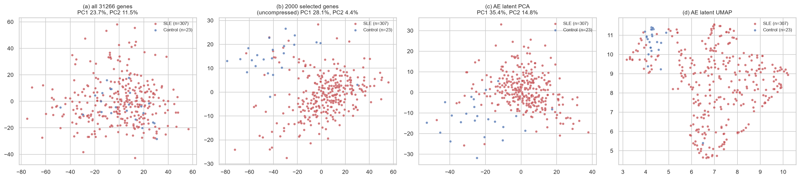

# Biomedical Representation Learning

> What do learned representations of gene expression capture that simpler, interpretable
> representations do not?

This project compares an unsupervised autoencoder's latent space against regularized linear
models and gradient boosting with SHAP attributions, on whole-blood gene expression from
patients with systemic lupus erythematosus (SLE). The question isn't which model wins — on
`n << p` biomedical data, regularized linear models often match neural networks — but whether
different modeling families find *the same structure*.

> **Status:** V1 complete. 129 tests, 100% coverage of `src/`, MIT licensed.

## Dataset

[GSE138458](https://www.ncbi.nlm.nih.gov/geo/query/acc.cgi?acc=GSE138458) — whole-blood
expression from an adult SLE cohort, single platform (GPL10558, Illumina HumanHT-12 v4).

| | |
|---|---|
| Samples (subjects) | 330 (218) |
| SLE | 307 samples / 196 subjects |
| Healthy control | 23 samples / 22 subjects |
| Probes | 47,323 (31,266 named genes) |


*The autoencoder's 32-dim latent space (right) separates SLE from control more clearly than the
same genes uncompressed (center) or raw expression (left) — see [Key findings](#key-findings) for
what this does and doesn't establish.*

## Key findings

- **Subject-level leakage matters more than sample-level splitting suggests.** 330 samples come
  from only 218 subjects. Every split here is grouped on subject, not just stratified on label.
- **Raw-feature PCA doesn't separate SLE from control** (silhouette −0.01) even though a linear
  model reaches ROC-AUC 0.97 — the disease signal isn't in the highest-variance directions.
- **Five classical baselines are statistically indistinguishable** given fold-to-fold noise; the
  simplest (L2 logistic regression) ties for best.
- **The autoencoder's 32-dim latent space matches classical performance at 1.6% of the feature
  count** (ROC-AUC 0.961, lowest variance of any model tested) — and organizes around a gene
  module that overlaps with neither the raw-variance genes nor the SHAP-flagged genes.
- **Three independent methods point to three non-overlapping gene sets at the same predictive
  ceiling** — on data this collinear, strong performance is compatible with real ambiguity about
  which genes are "responsible."

Full walkthrough, numbers, figures, and caveats: **[FINDINGS.md](FINDINGS.md)**

## Reproducing

```bash
python -m venv .venv
.venv/Scripts/activate        # Windows;  source .venv/bin/activate on macOS/Linux
pip install -e ".[dev]"

python -m ipykernel install --user --name biomedical-ml --display-name "Python 3 (biomedical-ml)"

python scripts/download_data.py
jupyter nbconvert --to notebook --execute --inplace notebooks/01_eda.ipynb
jupyter nbconvert --to notebook --execute --inplace notebooks/02_baselines.ipynb   # ~9 min
python scripts/train_ae.py                                                        # ~1 min
jupyter nbconvert --to notebook --execute --inplace notebooks/04_representation_comparison.ipynb

pytest -q
ruff check .
```

Every stochastic step is seeded (`config.set_seed()`, seed 42). `data/` is gitignored — the
download script reproduces it. Notebook outputs are stripped on commit via
[`nbstripout`](https://github.com/kynan/nbstripout); after install, run
`nbstripout --install --attributes .gitattributes` once per clone.

> **Note on TLS:** networks that terminate TLS at a proxy can break certificate verification
> against NCBI. The downloader uses `truststore` to defer to the OS trust store rather than
> disabling verification.

## Repository layout

```
src/biomedical_ml/
  config.py, data.py, preprocessing.py, splits.py   pipeline fundamentals
  eda.py, models.py, evaluation.py, shap_utils.py    classical analysis
  autoencoder.py, ae_training.py                     PyTorch AE + training/eval
scripts/    download_data.py, train_ae.py
notebooks/  01_eda, 02_baselines, 04_representation_comparison
tests/      unit tests; integration tests skip without the download
configs/    default.yaml — settings behind reported results
figures/ results/   generated outputs
```

## License

[MIT](LICENSE)

## Author

Athanasia Lantouri

Applied Machine Learning | Interpretable AI | Biomedical Data Science

GitHub: <https://github.com/lant96>